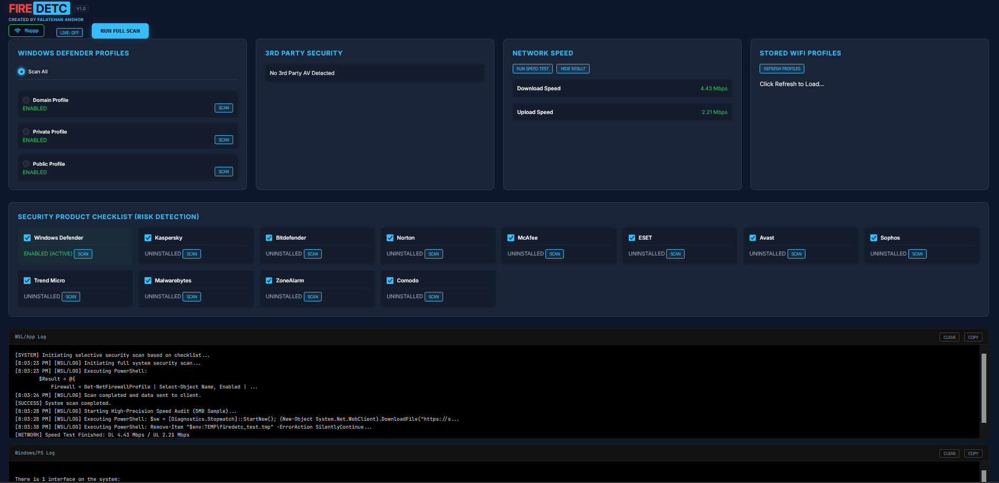
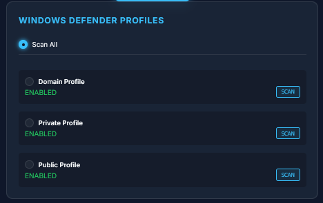
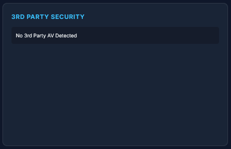
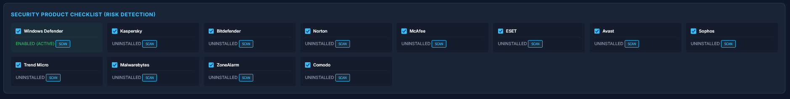
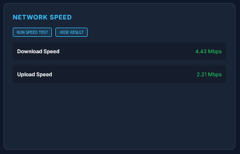
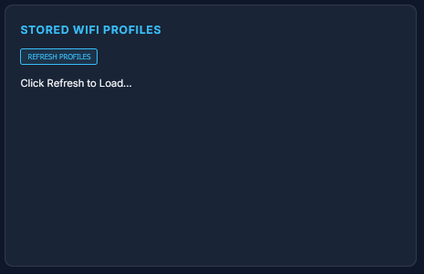
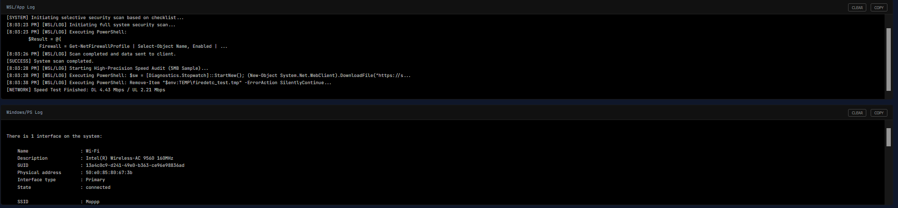
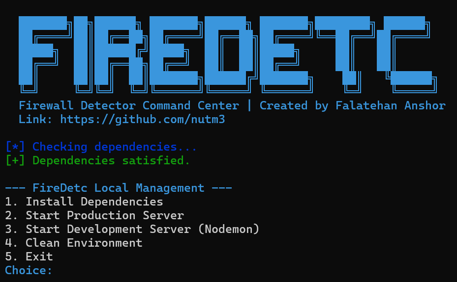
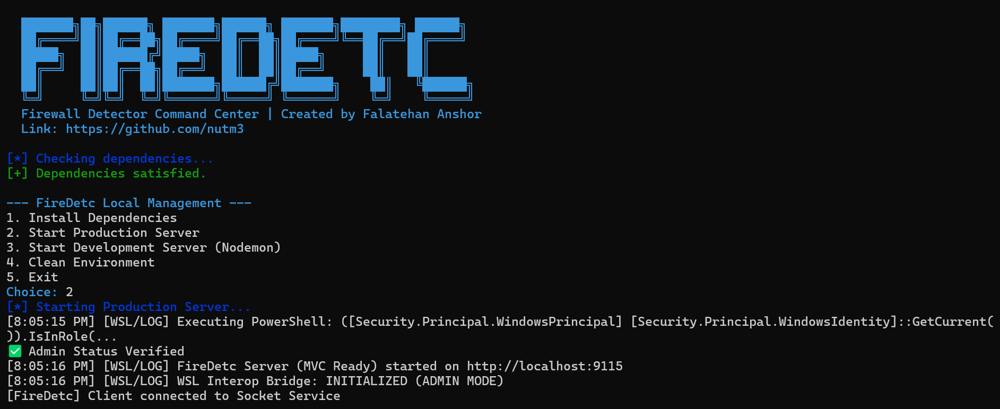
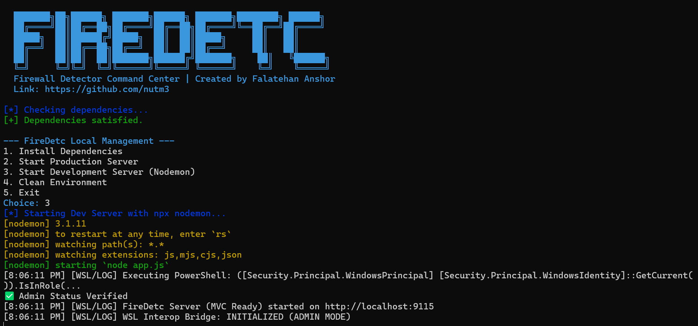

# ⚔️ FIREDETC V1.0: Advanced Security Interop Bridge
**Professional WSL-to-Host Security Auditor & Network Intelligence Toolkit**

[](https://github.com/nutm3)
[](https://opensource.org/licenses/MIT)
[]()

---

## 🖥️ Dashboard Overview


## 📖 Overview
**FIREDETC** is a specialized security command center designed for Offensive Security practitioners and System Auditors. It bridges the gap between the **WSL (Windows Subsystem for Linux)** environment and the **Windows Host**, providing real-time visibility into the host's security posture and network configuration through high-performance interop bridges.

---

## 🚀 Key Modules & Features

### 1. 🛡️ Windows Security Posture
Audits the status of the Windows Firewall and lists active Antivirus/EDR solutions.
- **Firewall Auditor**: Monitor Domain, Private, and Public profiles.
- **AV/EDR Detection**: Identifies 3rd party security products via WMI `SecurityCenter2`.

| Firewall Profiles | 3rd Party Security | Security Checklist |
|-------------------|--------------------|--------------------|
|  |  |  |

### 2. 📡 Network Intelligence
Precision monitoring and speed auditing from within WSL.
- **High-Precision Speed Audit**: Measures bandwidth via .NET `WebClient` interop.
- **Live Wi-Fi Bridge**: Real-time connected SSID and signal strength monitoring.



### 3. 🔐 Wireless Credential Recovery
Seamless extraction of stored Wi-Fi credentials from the host registry.
- **Profile Extractor**: Enumerate all stored SSIDs.
- **Credential Recovery**: One-click password extraction (`key=clear`).



---

## 🏗️ Technical Architecture
FireDetc uses a dual-interop approach to ensure maximum reliability and information density.



- **WSL/App Log**: Application-level events and API tracking.
- **Windows/PS Log**: Raw PowerShell bridge output for technical verification.

---

## 📥 Getting Started

### Prerequisites
- **OS**: Windows 10/11 with WSL2 (Kali Linux or Ubuntu recommended).
- **Environment**: Node.js installed on your WSL instance.
- **Privileges**: Terminal should be run as **Administrator** for full bridge functionality.

### Installation & Usage
The project includes a unified management script `build.sh` to handle everything.

1. **Clone & Setup**:
   ```bash
   git clone https://github.com/nutm3/FireDetc.git
   cd FireDetc/dist
   chmod +x build.sh
   ./build.sh
   ```

2. **Select Operation**:
   When you run `./build.sh`, you will see the management menu:
   - **Option 1**: Install necessary Node.js dependencies.
   - **Option 2**: Start the **Production Server** (Optimized for audit).
   - **Option 3**: Start the **Development Server** (Auto-reload enabled).
   - **Option 4**: Clean the environment (Removes `node_modules`).

| Initialization | Production Mode | Development Mode |
|----------------|-----------------|------------------|
|  |  |  |

3. **Access Dashboard**:
   Once running, open your browser at:
   `http://localhost:9115`

---

## 👨‍💻 Author
**Falatehan Anshor**
- [GitHub Profile](https://github.com/nutm3)
- [Project Repository](https://github.com/nutm3/FireDetc)

---

## ⚖️ Legal Disclaimer
*FireDetc is developed for educational and authorized security auditing purposes only. Use of this software for attacking targets without prior mutual consent is illegal. The author is not responsible for any misuse of this tool.*
